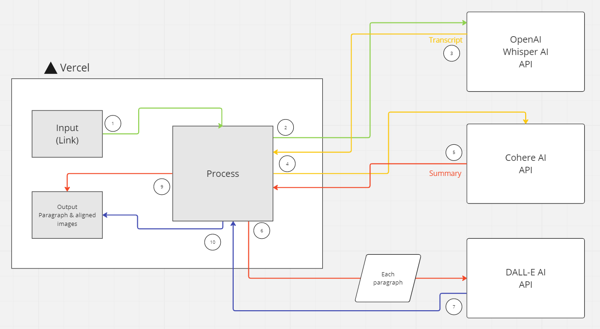

# ▶️ Arcplay
### Arcplay is a free and open source AI tool that takes a YouTube video link as input and generates an article accordingly.

## 🪄 How Arcplay works

Arcplay has various AI integrations that allow user to create an article tailor-made to the provided video.

The process starts when the user enteres the link to a YouTube video, that link is then parsed in the OpenAI WhisperAI API, which returns a transcript of the whole video. Once accepting that transcript, the entire text is prompted to the CohereAI API along with a prmopt to turn this transcript into an article.
Once that article is returned, each paragraph from that article is then prompted to DALL-E AI for image generation.

Once the entire image set is received, the user will be presented a UI with the results (article & images) mapped accordingly.

## ⚙️ Tech Stack
**Server-Side Rendered:** T3: Next.JS, TailwindCSS, TypeScript

## 🏔️ Upcoming features
- Ability to edit the article and images after being generated.

## ⚠️ Current bugs